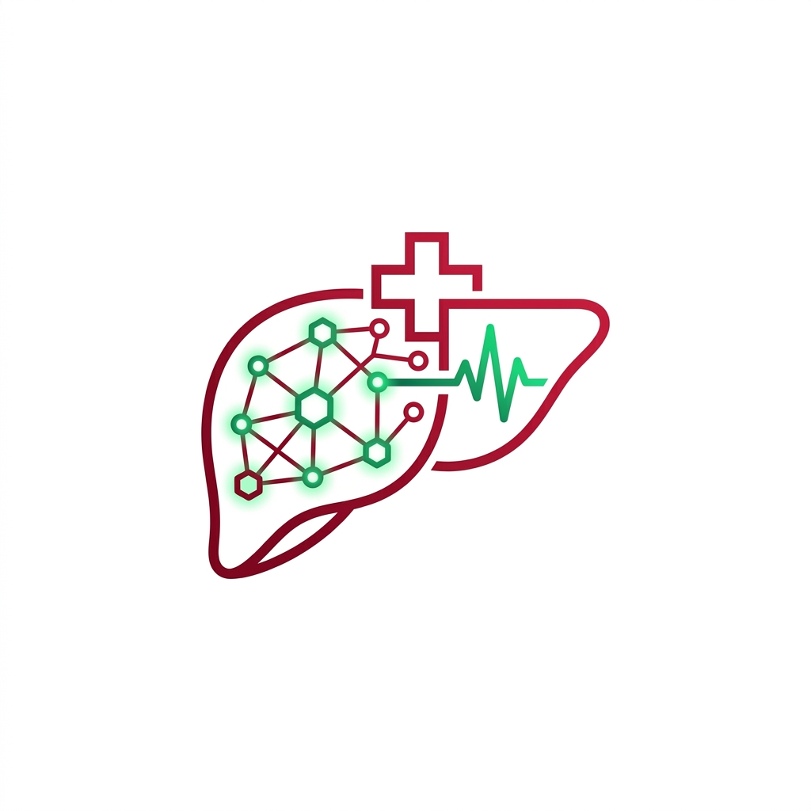

# Hepatitis C Detection and Staging using Machine Learning

<p align="center">
  
  <br>
  <strong>AI for Healthcare: Mini Project</strong>
</p>

## Project structure
```
james/
├── app.py                  # Flask web app (routes + inference)
├── templates/               # HTML pages (Bootstrap 5)
│   ├── base.html
│   ├── home.html
│   ├── predict.html
│   ├── result.html
│   └── about.html
├── static/css/style.css     # Custom medical-themed styling
├── streamlit_app.py.bak     # Optional Streamlit alternative frontend
├── train_model.py           # Data preprocessing + model training script
├── requirements.txt         # Python dependencies
├── data/
│   └── hcvdat0.csv          # Real UCI HCV dataset (615 patients)
├── model/
│   └── hcv_model.pkl        # Trained model bundle (generated by train_model.py)
├── REPORT.md                # Project report (Introduction / Importance / Conclusion)
└── README.md                # This file
```

## 1. Setup

```bash
cd james
python3 -m venv venv
source venv/bin/activate        # Windows: venv\Scripts\activate
pip install -r requirements.txt
```

## 2. Train (and save) the model

```bash
python train_model.py
```
This reads `data/hcvdat0.csv`, preprocesses it, trains both Random Forest and XGBoost,
picks the best (by macro-F1), and saves the full pipeline to `model/hcv_model.pkl`.

## 3. Run the web app

```bash
python app.py
```
Open `http://localhost:5000` in your browser.

## 4. Using the app

1. **Home** (`/`): project overview, model stats, disease stage legend.
2. **Predict** (`/predict`): enter the 12 lab values (Age, Sex, ALB, ALP, ALT, AST, BIL,
   CHE, CHOL, CREA, GGT, PROT) and click **Predict Stage**.
3. **About Model** (`/about`): model accuracy, feature list, stage descriptions, dataset info.

## Dataset

UCI Machine Learning Repository: Hepatitis C Virus (HCV) dataset, 615 real patient
records, 5 target classes: Blood Donor, Suspect Blood Donor, Hepatitis, Fibrosis, Cirrhosis.
